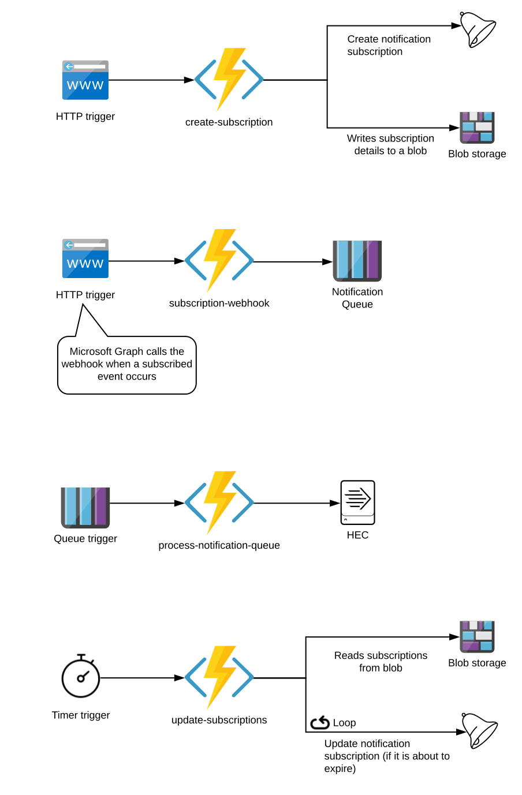

# Azure Functions for Splunk and Microsoft Graph

A collection of Azure Functions for:
* Managing Microsoft Graph notification [subscriptions](https://docs.microsoft.com/en-us/graph/api/resources/subscription)
* Retrieving data about notifications received from Microsoft Graph subscriptions
* Sending Microsoft Graph resource data to Splunk via [HTTP Event Collector](https://docs.splunk.com/Documentation/Splunk/latest/Data/UsetheHTTPEventCollector)

## Getting Started

### 1. Register your application
When you register an application with Azure AD, you are creating an identity configuration.  The Azure Functions in this project will use the application for authentication when interacting with the Microsoft Graph API.

#### Additional information
* [Registering an Azure AD application](docs/RegisterApplication.md) provides a detailed walkthrough
* [Application and service principal objects in Azure Active Directory](https://docs.microsoft.com/en-us/azure/active-directory/develop/app-objects-and-service-principals)

### 2. Deploy the functions to Azure

Use the above button to deploy the Azure Functions from this repo to your Azure account.  During setup, you will be prompted for the following information:

* Client ID
* Client Secret
* Splunk [HTTP Event Collector](https://docs.splunk.com/Documentation/Splunk/latest/Data/UsetheHTTPEventCollector) Endpoint
* Splunk [HTTP Event Collector](https://docs.splunk.com/Documentation/Splunk/latest/Data/UsetheHTTPEventCollector) Token

#### Securing Azure Function settings
Microsoft stores the above values as [application settings](https://docs.microsoft.com/en-us/azure/azure-functions/functions-how-to-use-azure-function-app-settings#settings). These settings are stored encrypted, but you may opt to transfer one or more of these settings to a Key Vault. Refer to the following documentation for details on this procedure:

* [Use Key Vault references for App Service and Azure Functions](https://docs.microsoft.com/en-us/azure/app-service/app-service-key-vault-references)

### 3. Create a Microsoft Graph subscription

A Microsoft Graph subscription defines where Microsoft should deliver notifications.  To create a subscription, execute the `create-subscription` function from the Azure Portal.

* Launch the [Azure Portal](https://portal.azure.com)
* Navigate to the Function app section in the portal
* Select the Function app created previously
* Click Functions -> create-subscription
    * Note: only [callRecords](https://docs.microsoft.com/en-us/graph/api/resources/callrecords-callrecord) subscriptions are created in this release.

* In the Overview section, click Get Function Url
* Copy the URL and paste it in a new browser tab

> Note: you may receive a timeout when executing this function for the first time. In this event, refresh your browser. The reason for this is the `create-subscription` function makes a call to the `subscription-webhook` function which may not be running yet.

* To list subscriptions, execute the `list-subscriptions` function.
* To delete a subscription, copy the subscription's ID field and pass it as a query parameter named `subscriptionId` to the `delete-subscription` function.
    * Example: `https://FUNCTION-APP.azurewebsites.net/api/delete-subscription?code=CODE&subscriptionId=SUBSCRIPTION_ID`

### 4. View data in Splunk

Run the following Splunk query

> `sourcetype="m365:*"`

(optional) Download and install the [Microsoft 365 App for Splunk](https://splunkbase.splunk.com/app/3786/)

## Support
This software is released as-is. Splunk provides no warranty and no support on this software. If you have any issues with the software, please file an issue on the repository.

## How it works
1. When the `create-subscription` function successfully creates a Microsoft Graph subscription, the subscription ID and expiration date is written to a storage blob.
1. After a subscribed event occurs, a notification is sent to the `subscription-webhook`.  The `subscription-webhook` commits the data to a notification queue to keep things speedy.
1. When an event arrives on the notification queue, the `process-notification-queue` function is triggered.  This function retrieves the data from Microsoft Graph and forwards the data to Splunk.
1. Since subscriptions have a short lifespan, the `update-subscriptions` function periodically reads the blobs and will update subscriptions if they are about to expire.

